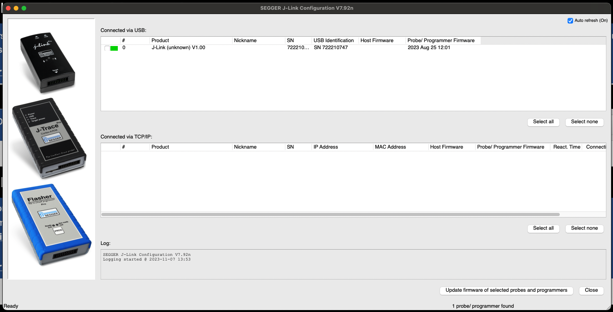
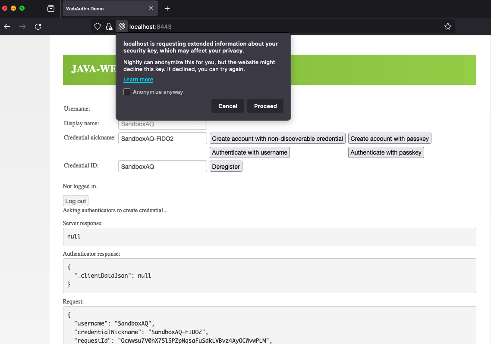
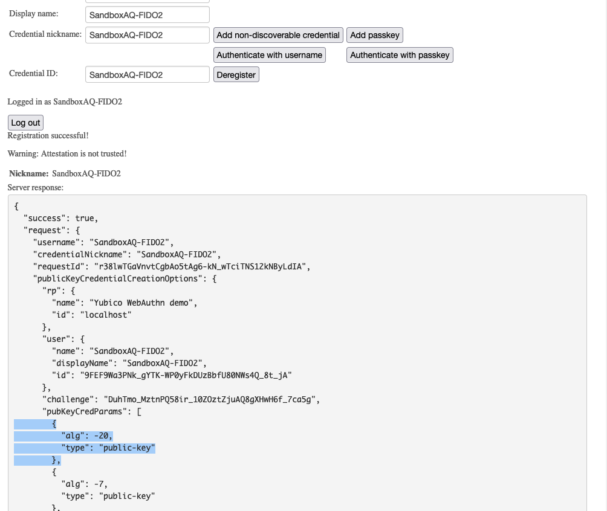
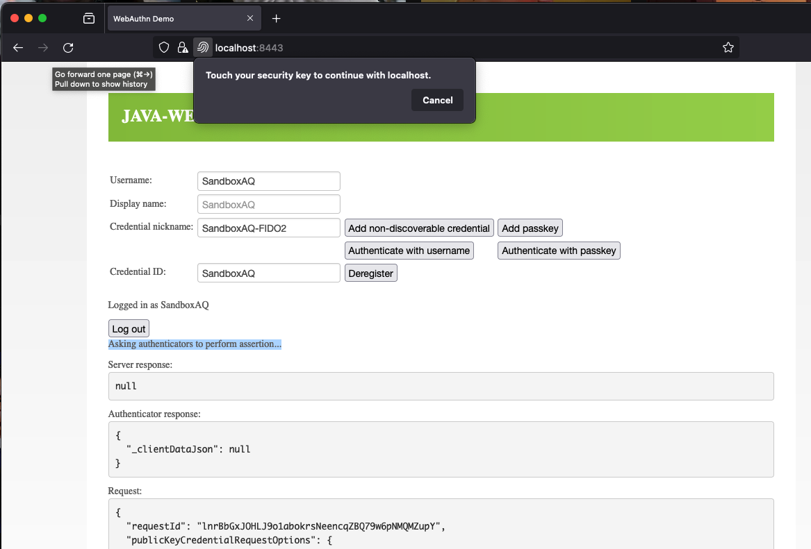
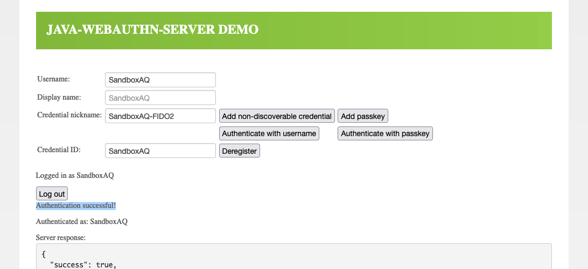

# PQC FIDO2
In this project, we add support for post-quantum algorithms on FIDO2. We implemented Dilithium3 for Signing in WebAuthn and Kyber768 for KEM in CTAP2. The current implementation only supports discoverable (resident) credentials.

FIDO2 involves three main entities:

1. authenticator,
2. browser and
3. server.

We needed to change all these three entities. In our prototype, we use solo2 firmware for `authenticator`, Firefox browser and `java-webauthn-server` from Yubico.

## Setup

Clone this repository and its submodules.

```
git clone git@github.com:sandbox-quantum/pqc-fido2-impl.git --recurse-submodules
```

## Web Authentication Server

### Build `liboqs-java`

*Note*: You have to build `liboqs` first.

Go to `liboqs-java/`, and follow the [Building the OQS dependency](https://github.com/sandbox-quantum/liboqs-java_fork#building-the-oqs-dependency) instructions.

Next, follow the [Building the Java OQS wrapper instructions](https://github.com/sandbox-quantum/liboqs-java_fork#building-the-java-oqs-wrapper):

```
mvn package -P macosx -Dliboqs.include.dir="/usr/local/include" -Dliboqs.lib.dir="/usr/local/lib"
```

### Start Java Web Auth Server

Go to `java-webauthn-server/`, run:

```
./gradlew run
```

## Firefox browser with PQC authenticator

You have to install [`Mercurial`](https://pypi.org/project/mercurial/) before building Firefox.

Follow the [Bootstrap a copy of the Firefox source code](https://firefox-source-docs.mozilla.org/setup/linux_build.html#bootstrap-a-copy-of-the-firefox-source-code)

```
curl https://hg.mozilla.org/mozilla-central/raw-file/default/python/mozboot/bin/bootstrap.py -O
python3 bootstrap.py
```

Select `1. Firefox for Desktop Artifact Mode [default]` as our default build option.

Patch `Cargo.toml` with our `authenticator-rs` module:

- Open `mozilla-unified/Cargo.toml`.
- Under `[patch.crates-io]`, add `authenticator = { path = "../authenticator-rs", version = "0.4.0-alpha.18", features = ["gecko"] }`.
- Update Cargo: `cargo update -p authenticator`. Ingore the `bindgen` errors.

Then, at `mozilla-unified/` run:
```
./mach build
./mach run
```
We tested with 118.0a1 Firefox nightly. The new versions of Firefox should also work as long as modified `authenticator-rs` is used.


## Hardware Authenticator

Hardware setup:

- [LPCXpresso55S69](https://www.nxp.com/design/software/development-software/mcuxpresso-software-and-tools-/lpcxpresso-boards/lpcxpresso55s69-development-board:LPC55S69-EVK) development board and 2 USB cables.

- Connect 2 USB cables to two ports: P9 High-Speed ("High Spd" label) and P6 Debug Probe ("Debug Link" label).

Before flashing hardware, make sure you can connect to the board using SEGGER J-Jink and install `JLinkGDBServer`.



In two terminals:

- Terminal 1: `JLinkGDBServer -strict -device LPC55S69 -if SWD -vd`
- Terminal 2: Go to `solo2/` directory, run `make run-dev`

To verify that the hardware authenticator is working, we use `fido2-token` tool from `libfido2`:

```
❯ fido2-token -L
ioreg://4296480287: vendor=0x1209, product=0xbeee (SoloKeys Solo 2 (custom))
```

## Test

1. Visit https://localhost:8443 in the Firefox browser and click on the "Create account with passkey" button. This will initiate the registration process using a resident key.



Select "Proceed" and click the **USER** button on the board.

Output of the successful registration.



In our experiment, Dilithium3 ID is `-20`, you can see it in our [patched COSEY module](https://github.com/sandbox-quantum/cosey_fork/blob/pqc_kyber768_dilithium3/src/lib.rs#L76)


2. For authentication click "Authenticate with passkey" to authenticate with the resident key.

Select "Proceed" and click the **USER** button on the board.



Output of the successful authentication.



## List of forked projects

| Project | Branch | 
| ------- | ------ |
| [java-webauthn-server](https://github.com/sandbox-quantum/java-webauthn-server_fork) | add_Kyber768_Dilithium3_and_liboqs |
| [liboqs-java](https://github.com/sandbox-quantum/liboqs-java_fork) | update_config_and_fix_error |
| [authenticator-rs](https://github.com/sandbox-quantum/authenticator-rs_fork) | add_Kyber_and_Dilithium |
| [solo2](https://github.com/sandbox-quantum/solo2_fork) | pqc_kyber768_dilithium3 |
| [trussed](https://github.com/sandbox-quantum/trussed_fork) | pqc_kyber768_dilithium3 |
| [fido-authenticator](https://github.com/sandbox-quantum/fido-authenticator_fork) | pqc_kyber768_dilithium3 |
| [ctap-types](https://github.com/sandbox-quantum/ctap-types_fork) | pqc_kyber768_dilithium3 |
| [cosey](https://github.com/sandbox-quantum/cosey_fork) | pqc_kyber768_dilithium3 |


## License

<sup>`PQC FIDO2` project is licensed under either [Apache License, Version 2.0](LICENSE-APACHE) or [MIT License](LICENSE-MIT) at your option.</sup>
<br>
<sub>Unless you explicitly state otherwise, any contribution intentionally submitted for inclusion in the work by you, as defined in the Apache-2.0 license, shall be dual licensed as above, without any additional terms or conditions.</sub>
